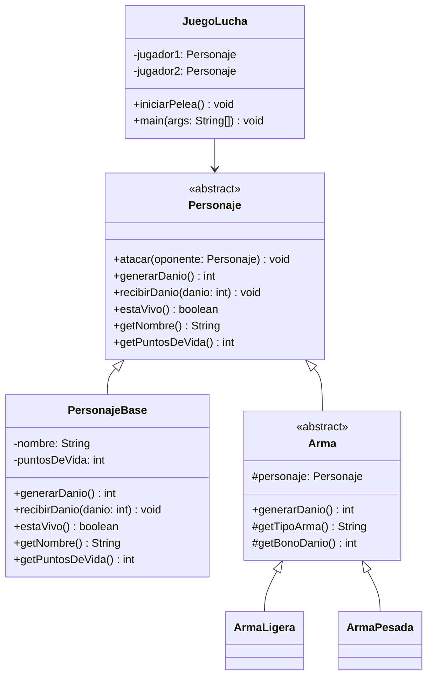

# Diagrama de clases

```mermaid
classDiagram
    class Personaje {
        <<abstract>>
        +atacar(oponente: Personaje) void
        +generarDanio() int
        +recibirDanio(danio: int) void
        +estaVivo() boolean
        +getNombre() String
        +getPuntosDeVida() int
    }

    class PersonajeBase {
        -nombre: String
        -puntosDeVida: int
        +generarDanio() int
        +recibirDanio(danio: int) void
        +estaVivo() boolean
        +getNombre() String
        +getPuntosDeVida() int
    }

    class Arma {
        <<abstract>>
        #personaje: Personaje
        +generarDanio() int
        #getTipoArma() String
        #getBonoDanio() int
    }

    class ArmaLigera
    class ArmaPesada
    class JuegoLucha {
        -jugador1: Personaje
        -jugador2: Personaje
        +iniciarPelea() void
        +main(args: String[]) void
    }

    Personaje <|-- PersonajeBase
    Personaje <|-- Arma
    Arma <|-- ArmaLigera
    Arma <|-- ArmaPesada
    JuegoLucha --> Personaje
```
